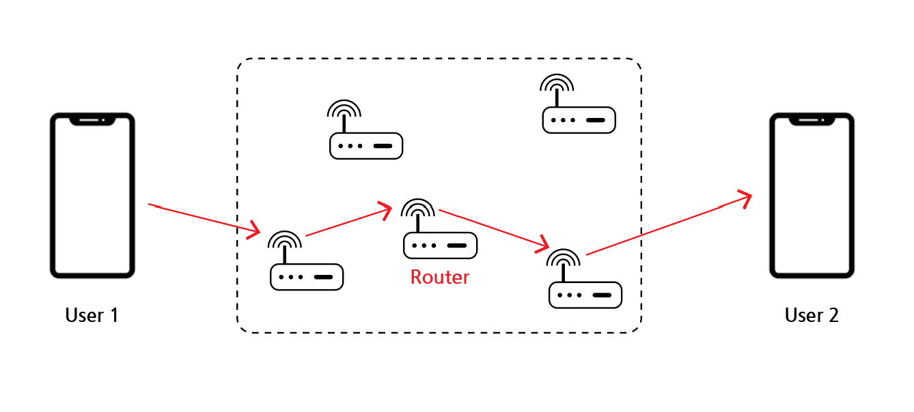
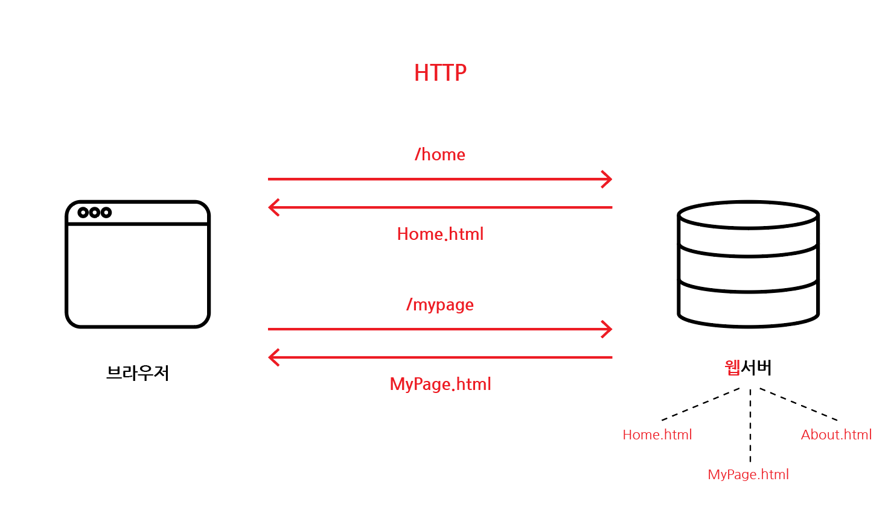
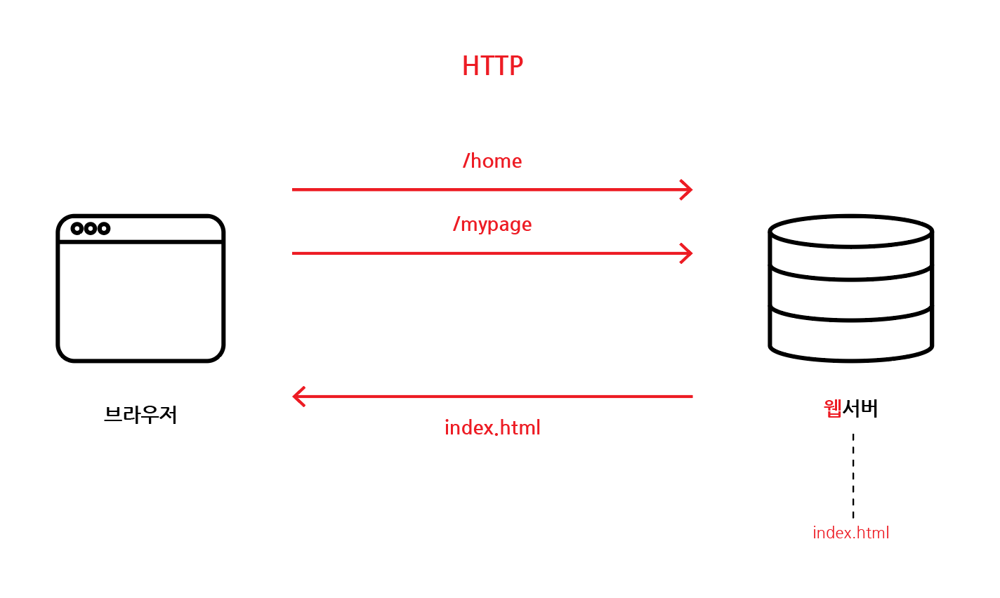
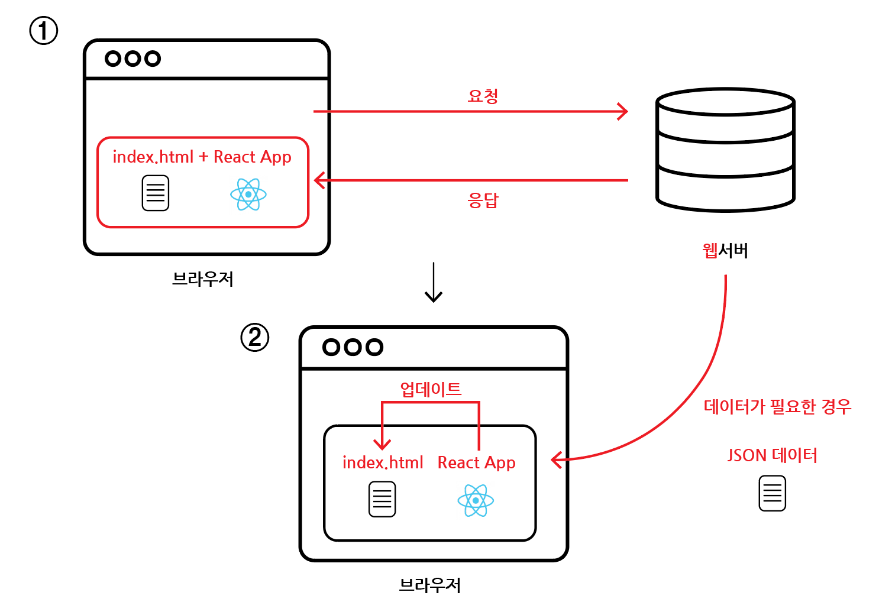
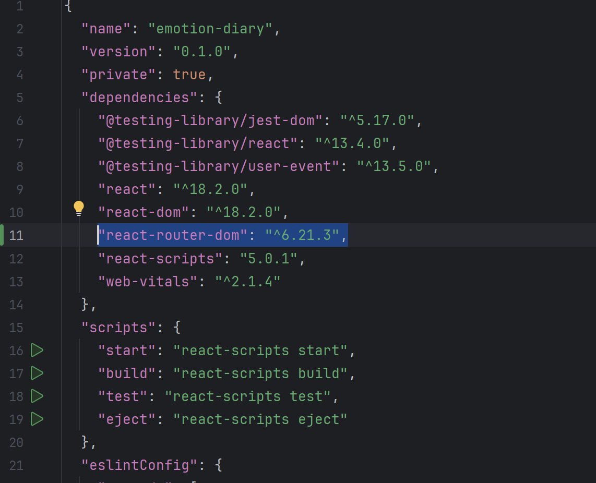
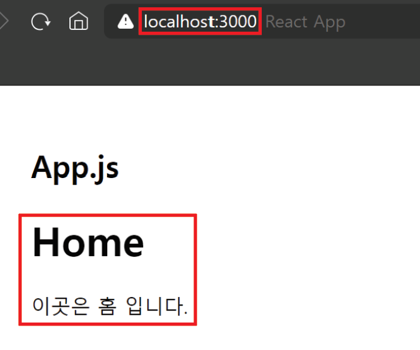
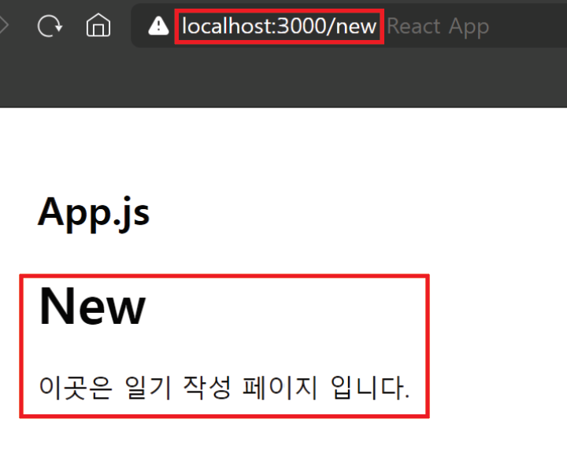

# 감성 일기장 만들기

본 프로젝트는 ["한입 크기로 잘라 먹는 리액트 강의"](https://www.udemy.com/course/winterlood-react-basic/)의 "감성 일기장 만들어 보기"를 클론한 프로젝트로 "리액트"의 기초 지식을 학습하는 것을 목표하였습니다.

<br>

## 목차

1. [페이지 라우팅 - React SPA & CSR](#1-페이지-라우팅---react-spa--csr)
2. [페이지 라우팅 - React Router 기본](#2-페이지-라우팅---react-router-기본)

<br>
<br>

## 1. 페이지 라우팅 - React SPA & CSR

### 1-1. Page Routing

### - Routing

- 어떤 네트워크 내에서 통신 데이터를 보낼 `경로를 선택`하는 일련의 과정
- `Router` : 데이터의 경로를 실시간으로 지정해주는 역할을 하는 것



<네트워크 통신 시, 라우터>

<br>

### - Page Routing이란?

- 브라우저에서 보낸 `요청`을 바탕으로 알맞은 `페이지(템플릿)`을 웹 서버에서 `응답`하는 것
- 새로운 요청마다 새로운 페이지를 응답하게 되고 그 과정에서 브라우저는 `새로고침(화면깜박임)`이 발생하게 됨



<MPA 페이지 라우팅>

- `MPA(Multi page Application)` : 위의 그림과 같이 `여러 개의 페이지`를 준비해두었다가 요청이 들어오면 경로에 따라 적절한 페이지를 응답하는 방식

<br>

### 1-2. SPA(Single page Application)

- React는 MPA이 아닌 `SPA(Singlepage Application`의 방식을 사용
- 어떠한 요청이 주어져도 `단일한 페이지`를 응답함
- 요청마다 새로고침이 발생하지 않아 페이지의 이동이 `빠르고 쾌적함`



<SPA 페이지 라우팅>

<br>

### - SPA 작동 원리



1. 초기에 웹 서버에서 `단일 페이지`와 함께 `React app`을 전달해줌
2. 이후, 업데이트 시, 웹 서버가 아닌 브라우저의 `React app`에서 `페이지를 업데이트` 해주기 때문에 빠름(클라이언트 측에서 처리)
3. 서버의 응답을 기다리지 않을 수 있음
4. 하지만, 데이터가 변하거나, 새로운 `데이터가 필요`한 경우에는 일단 화면을 업데이트하고 `데이터만 서버에서 응답`받아 채우게 됨

<br>

### 1-3. CSR (Client Side Rendering)

- SPA 방식과 같이 `클라이언트 측`에서 `화면을 렌더링`하는 것

<br>
<br>

## 2. 페이지 라우팅 - React Router 기본

### 2-1. 프로젝트 생성

- `npx create-react-app emotion-diary`로 React 앱 생성

<br>

### 2-2. React Router

- React에서 Page Routing을 하기 위해서는 `React Router`가 필요함
- `React Router` : 클라이언트 사이드 렌더링(CSR)을 도와주는 라이브러리
- [React Router 라이브러리 공식 사이트](https://reactrouter.com/en/main)

<br>

### - React Router 설치

```bash
$ npm install react-router-dom@(버전)
```

<br>



<package.json 파일 dependencies에서 설치된 react-router 확인>

<br>

### - Router로 관리할 페이지 모음 폴더 및 페이지 생성

- src/`pages` 폴더 생성
- 폴더 안에 `Home.js`, `New.js`, `Edit.js`, `Diary.js` 파일 생성

<br>

```jsx
// src/pages/Home.js

const Home = () => {
    return (
        <div>
            <h1>Home</h1>
            <p>이곳은 홈 입니다.</p>
        </div>
    );
};

export default Home;

// 다른 페이지들도 동일하게 세팅
```

- 각 페이지 컴포넌트로 구성

<br>

### - App 컴포넌트에서 Route 분배하기

<라이브러리, 컴포넌트 가져오기>

```jsx
// src/App.js

import { BrowserRouter, Route, Routes } from "react-router-dom";

import Home from "./pages/Home";
import New from "./pages/New";
import Edit from "./pages/Edit";
import Diary from "./pages/Diary";
```

- react-route-dom 라이브러리에서 `BrowserRouter`, `Route`, `Routes` 가져오기
- pages 폴더에서 생성한 각 페이지 컴포넌트 가져오기

<br>

<React Router 적용>

```jsx
// src/App.js

return (
    <BrowserRouter>
        <div className="App">
            <h2>App.js</h2>
            <Routes>
                <Route path="/" element={<Home />} />
                <Route path="/new" element={<New />} />
            </Routes>
        </div>
    </BrowserRouter>
);
```

- `BrowserRouter` : React Router를 적용할 `전체 App` 컴포넌트를 감싸기
- `Routes` : Route 적용할 `컴포넌트들` 묶기
- `Route` : 각각의 path(경로)와 element(컴포넌트) `매핑`
- 따라서 매핑된 컴포넌트는 해당 url 경로인 경우에만 렌더링 됨



<host:3000/ 화면>

<br>



<host:3000/new/ 화면>

<br>

### - Base Template

- Routes 컴포넌트로 감싸지 않은 `<h2>App.js</h2>`의 경우 계속 렌더링되는 것을 알 수 있음
- 따라서 Base Template으로 `계속 화면에 출력`되어야하는 header, navbar, footer는 `Routes에 감싸지 않음`으로써 계속 화면에 출력되도록 할 수 있음

<br>

### - 화면 이동시키는 요소 만들기 Link

<기존 a 태그로 링크 작성>

```jsx
// src/App.js

<a href={"/new"}>New로 이동</a>
```

- a 태그를 이용하여 링크를 만들고 href 속성으로 경로 연결
- 해당 링크 클릭 시, 해당 url로 이동을 하지만 `새로고침`이 발생됨(MPA처럼 작동함)

<br>

<React Router에서 제공하는 Link 컴포넌트 사용하기>

- components 폴더 만들고 테스트용 컴포넌트 생성

```jsx
// src/components/RouterTest.js

import { Link } from "react-router-dom";

const RouteTest = () => {
    return (
        <div>
            <Link to={"/"}>HOME</Link>
            <br />
            <Link to={"/diary"}>DIARY</Link>
            <br />
            <Link to={"/new"}>NEW</Link>
            <br />
            <Link to={"/edit"}>EDIT</Link>
        </div>
    );
};

export default RouteTest;
```

- `react-router-dom` 라이브러리에서 제공하는 `Link` 가져오기
- Link의 `to 속성`에 `경로(path)` 매핑하기
- 해당 컴포넌트 내보내기

<br>

```jsx
// src/App.js

import RouteTest from "./components/RouteTest";

<BrowserRouter>
    <div className="App">
        <h2>App.js</h2>
        <Routes>
            <Route path="/" element={<Home />} />
            <Route path="/new" element={<New />} />
            <Route path="/edit" element={<Edit />} />
            <Route path="/diary" element={<Diary />} />
        </Routes>
        <RouteTest />
    </div>
</BrowserRouter>
```

- 해당 컴포넌트 App 컴포넌트에 가져오기
- 이렇게 Link 컴포넌트를 사용하면 SPA로 동작하며 화면 이동 시, 새로고침이 되지 않음

<br>

### 2-3. React Router 정리

- 해당 경로마다 렌더링 될 페이지를 매핑해주게 되면 url에 따라서 다른 페이지로 이동함
- 실제로는 이동하기보다는 주어진 `index 단일 페이지`에서 `url`에 따라서 `컴포넌트들을 교체`해준다고 이해할 수 있음
- 화면 전환의 속도가 매우 빠름

<br>
<br>