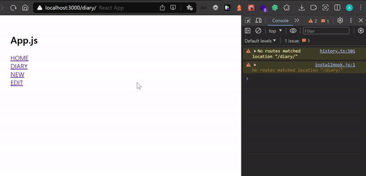

# 감성 일기장 만들기

본 프로젝트는 ["한입 크기로 잘라 먹는 리액트 강의"](https://www.udemy.com/course/winterlood-react-basic/)의 "감성 일기장 만들어 보기"를 클론한 프로젝트로 "리액트"의
기초 지식을 학습하는 것을 목표하였습니다.

<br>

## 목차

1. [페이지 라우팅 - React SPA & CSR](#1-페이지-라우팅---react-spa--csr)
2. [페이지 라우팅 - React Router 기본](#2-페이지-라우팅---react-router-기본)
3. [페이지 라우팅 - React Router 응용](#3-페이지-라우팅---react-router-응용)
4. [프로젝트 기초공사 1](#4-프로젝트-기초공사-1)
5. [프로젝트 기초공사 2](#5-프로젝트-기초공사-2)
6. [페이지 구현](#6-페이지-구현)
7. [버그](#7-버그)
8. [LocalStorage](#8-localstorage)
9. [최적화](#9-최적화)

<br>
<br>

## 1. 페이지 라우팅 - React SPA & CSR

### 1-1. Page Routing

### - Routing

- 어떤 네트워크 내에서 통신 데이터를 보낼 `경로를 선택`하는 일련의 과정
- `Router` : 데이터의 경로를 실시간으로 지정해주는 역할을 하는 것


<네트워크 통신 시, 라우터>

<br>

### - Page Routing이란?

- 브라우저에서 보낸 `요청`을 바탕으로 알맞은 `페이지(템플릿)`을 웹 서버에서 `응답`하는 것
- 새로운 요청마다 새로운 페이지를 응답하게 되고 그 과정에서 브라우저는 `새로고침(화면깜박임)`이 발생하게 됨


<MPA 페이지 라우팅>

- `MPA(Multi page Application)` : 위의 그림과 같이 `여러 개의 페이지`를 준비해두었다가 요청이 들어오면 경로에 따라 적절한 페이지를 응답하는 방식

<br>

### 1-2. SPA(Single page Application)

- React는 MPA이 아닌 `SPA(Singlepage Application`의 방식을 사용
- 어떠한 요청이 주어져도 `단일한 페이지`를 응답함
- 요청마다 새로고침이 발생하지 않아 페이지의 이동이 `빠르고 쾌적함`


<SPA 페이지 라우팅>

<br>

### - SPA 작동 원리


1. 초기에 웹 서버에서 `단일 페이지`와 함께 `React app`을 전달해줌
2. 이후, 업데이트 시, 웹 서버가 아닌 브라우저의 `React app`에서 `페이지를 업데이트` 해주기 때문에 빠름(클라이언트 측에서 처리)
3. 서버의 응답을 기다리지 않을 수 있음
4. 하지만, 데이터가 변하거나, 새로운 `데이터가 필요`한 경우에는 일단 화면을 업데이트하고 `데이터만 서버에서 응답`받아 채우게 됨

<br>

### 1-3. CSR (Client Side Rendering)

- `클라이언트 측`에서 `화면을 렌더링`하는 것

<br>
<br>

## 2. 페이지 라우팅 - React Router 기본

### 2-1. 프로젝트 생성

- `npx create-react-app emotion-diary`로 React 앱 생성

<br>

### 2-2. React Router

- React에서 Page Routing을 하기 위해서는 `React Router`가 필요함
- `React Router` : 클라이언트 사이드 렌더링(CSR)을 도와주는 라이브러리
- [React Router 라이브러리 공식 사이트](https://reactrouter.com/en/main)

<br>

### - React Router 설치

```bash
$ npm install react-router-dom@(버전)
```

<br>


<package.json 파일 dependencies에서 설치된 react-router 확인>

<br>

### - Router로 관리할 페이지 모음 폴더 및 페이지 생성

- src/`pages` 폴더 생성
- 폴더 안에 `Home.js`, `New.js`, `Edit.js`, `Diary.js` 파일 생성

<br>

```jsx
// src/pages/Home.js

const Home = () => {
  return (
    <div>
      <h1>Home</h1>
      <p>이곳은 홈 입니다.</p>
    </div>
  );
};

export default Home;

// 다른 페이지들도 동일하게 세팅
```

- 각 페이지 컴포넌트로 구성

<br>

### - App 컴포넌트에서 Route 분배하기

<라이브러리, 컴포넌트 가져오기>

```jsx
// src/App.js

import {BrowserRouter, Route, Routes} from "react-router-dom";

import Home from "./pages/Home";
import New from "./pages/New";
import Edit from "./pages/Edit";
import Diary from "./pages/Diary";
```

- react-route-dom 라이브러리에서 `BrowserRouter`, `Route`, `Routes` 가져오기
- pages 폴더에서 생성한 각 페이지 컴포넌트 가져오기

<br>

<React Router 적용>

```jsx
// src/App.js

return (
  <BrowserRouter>
    <div className="App">
      <h2>App.js</h2>
      <Routes>
        <Route path="/" element={<Home/>}/>
        <Route path="/new" element={<New/>}/>
      </Routes>
    </div>
  </BrowserRouter>
);
```

- `BrowserRouter` : React Router를 적용할 `전체 App` 컴포넌트를 감싸기
- `Routes` : Route 적용할 `컴포넌트들` 묶기
- `Route` : 각각의 path(경로)와 element(컴포넌트) `매핑`
- 따라서 매핑된 컴포넌트는 해당 url 경로인 경우에만 렌더링 됨


<host:3000/ 화면>

<br>


<host:3000/new/ 화면>

<br>

### - Base Template

- Routes 컴포넌트로 감싸지 않은 `<h2>App.js</h2>`의 경우 계속 렌더링되는 것을 알 수 있음
- 따라서 Base Template으로 `계속 화면에 출력`되어야하는 header, navbar, footer는 `Routes에 감싸지 않음`으로써 계속 화면에 출력되도록 할 수 있음

<br>

### - 화면 이동시키는 요소 만들기 Link

<기존 a 태그로 링크 작성>

```jsx
// src/App.js

<a href={"/new"}>New로 이동</a>
```

- a 태그를 이용하여 링크를 만들고 href 속성으로 경로 연결
- 해당 링크 클릭 시, 해당 url로 이동을 하지만 `새로고침`이 발생됨(MPA처럼 작동함)

<br>

<React Router에서 제공하는 Link 컴포넌트 사용하기>

- components 폴더 만들고 테스트용 컴포넌트 생성

```jsx
// src/components/RouterTest.js

import {Link} from "react-router-dom";

const RouteTest = () => {
  return (
    <div>
      <Link to={"/"}>HOME</Link>
      <br/>
      <Link to={"/diary"}>DIARY</Link>
      <br/>
      <Link to={"/new"}>NEW</Link>
      <br/>
      <Link to={"/edit"}>EDIT</Link>
    </div>
  );
};

export default RouteTest;
```

- `react-router-dom` 라이브러리에서 제공하는 `Link` 가져오기
- Link의 `to 속성`에 `경로(path)` 매핑하기
- 해당 컴포넌트 내보내기

<br>

```jsx
// src/App.js

import RouteTest from "./components/RouteTest";

<BrowserRouter>
  <div className="App">
    <h2>App.js</h2>
    <Routes>
      <Route path="/" element={<Home/>}/>
      <Route path="/new" element={<New/>}/>
      <Route path="/edit" element={<Edit/>}/>
      <Route path="/diary" element={<Diary/>}/>
    </Routes>
    <RouteTest/>
  </div>
</BrowserRouter>
```

- 해당 컴포넌트 App 컴포넌트에 가져오기
- 이렇게 Link 컴포넌트를 사용하면 SPA로 동작하며 화면 이동 시, 새로고침이 되지 않음

<br>

### 2-3. React Router 정리

- 해당 경로마다 렌더링 될 페이지를 매핑해주게 되면 url에 따라서 다른 페이지로 이동함
- 실제로는 이동하기보다는 주어진 `index 단일 페이지`에서 `url`에 따라서 `컴포넌트들을 교체`해준다고 이해할 수 있음
- 화면 전환의 속도가 매우 빠름

<br>
<br>

## 3. 페이지 라우팅 - React Router 응용

### 3-1. 학습목표

- `useParams` : Path Variable(경로 변수)
- `useSearchParams` : Query String(url로 데이터 전달)
- `useNavigate` : Page Moving(Link가 아닌 함수로 페이지 이동)

<br>

### 3-2. Path Variable & useParams

### - Diary 페이지

- 경로 : '/diary'
- 특징 : 특정 일기의 상세 페이지로서 어떤 일기를 보여주어야 할 지 전달 받아야함
- ex) /diary/1 -> 1번 일기

<br>

### - Path Variable

```jsx
// App.js

<BrowserRouter>
  <div className="App">
    <h2>App.js</h2>
    <Routes>
      <Route path="/" element={<Home/>}/>
      <Route path="/new" element={<New/>}/>
      <Route path="/edit" element={<Edit/>}/>
      <Route path="/diary/:id" element={<Diary/>}/>
    </Routes>
    <RouterTest/>
  </div>
</BrowserRouter>
```

- diary 경로 뒤에 `:id`를 포함시킴
- 각 id 값에 따라서 diary 경로를 분배시킴

<br>

### - useParams

```jsx
// pages/Diary.js

import {useParams} from "react-router-dom";

const Diary = () => {
  const {id} = useParams();
  console.log(id);
};
```

- React 자체에서가 아닌 라이브러리에서 제공하는 `커스텀 Hooks`인 `useParams` 가져오기
- id 값을 useParams로 설정하면 해당 id 값을 Diary 페이지에서 이용할 수 있음

<br>



<useParams로 가져온 id 값을 콘솔로 출력하기>

<br>

### 3-3. Query String & useSearchParams

### - Query String

```
- Query 전달 예시

URL : https://site.com/edit?id=10&mode=dark
```

- `Query` : 웹 페이지에서 데이터를 전달하는 가장 간단한 방법
- `Query String` : url에서 물음표 키워드('?') 뒤에 전달되는 데이터
    - `name=value`의 형태로 '&'를 사용하여 여러 데이터를 묶음

<br>

### - Query String은 path 설정 안함

- 앞선 `Path Variable`의 경우, `/diary/:id`와 같이 받을 Path Variable을 경로에 설정해주었음
- 반면, `Query String`의 경우, 경로에 별도의 설정을 하지 않아도 됨

<br>

### - useSearchParams

```jsx
// pages/Edit.js

import {useSearchParams} from "react-router-dom";

const Edit = () => {
  const [searchParams, setSearchParams] = useSearchParams()

  const id = searchParams.get('id');
  console.log('id : ', id);

  const mode = searchParams.get('mode');
  console.log('mode : ', mode);

...
  <button onClick={() => {
    setSearchParams({who: '조정곤'})
  }}>QS 바꾸기
  </button>
};
```

- `useSearchParams` : 커스텀 Hooks 중 하나로 useState와 유사하게 비구조화 할당을 통해 `searchParams`와 `setSearchParams`를 받음
- `searchParams` : 전달받은 Query String이 객체로 담겨 있으며, `.get()` 메서드를 통해 데이터 값을 가져올 수 있음
- `setSearchParams` : searchParams `객체를 업데이트`하는 함수

<br>


<useSearchParams로 가져온 Query String 값을 콘솔로 출력하고 버튼으로 searchParams 업데이트>

<br>

### 3-4. Page Moving & useNavigate

### - useNavigate

```jsx
// pages/Edit.js

import {useNavigate, useSearchParams} from "react-router-dom";

const Edit = () => {
  const navigate = useNavigate();

...
  // 경로 페이지로 이동
  <button onClick={() => {
    navigate('/home')
  }}>HOME으로 가기
  </button>

  // 해당 숫자만큼 뒤로가기
  <button onClick={() => {
    navigate(-1)
  }}>뒤로가기
  </button>
}
```

- `useNavigate` : 커스텀 Hooks 중 하나로, `페이지를 이동할 수 있는 함수`를 반환함, 따라서 이 함수를 navigate라는 변수에 할당
- 버튼 onClick의 콜백함수에 navigate 함수를 넣고 `인자로 경로`를 받으면 버튼 클릭 시, 해당 페이지로 이동함
- 경로 대신 `-(숫자)`를 넣게 되면 숫자만큼 `뒤로가기` 수행

<br>


<useNavigate를 사용하여 페이지 이동 및 뒤로가기>

<br>
<br>

## 4. 프로젝트 기초공사 1

### 4-1. 세팅 항목

- 폰트 세팅 : Google Web Fonts 이용
- 레이아웃 세팅 : 모든 페이지에 반영되는 레이아웃 세팅
- 이미지 에셋 세팅 : 감정 표현 이미지들을 프로젝트에서 불러와 사용할 수 있도록 환경 세팅
- 공통 컴포넌트 세팅 : 모든 페이지에 공통으로 사용되는 버튼, 헤더 컴포넌트 세팅

<br>

### 4-2. 폰트 세팅

- [Google Web Font](https://fonts.google.com/) 사이트에서 사용할 폰트를 찾아 select하기
- `@import...` 구문을 App.css 파일 상단에 붙여넣기
- css로 font-family 속성 추가

```css
/*src/App.css*/

@import url('https://fonts.googleapis.com/css2?family=Nanum+Gothic&family=Noto+Sans+KR&display=swap');

.App {
    padding: 20px;
    font-family: 'Nanum Gothic', sans-serif;
    font-family: 'Noto Sans KR', sans-serif;
}
```

<br>

### 4-3. 레이아웃 세팅

- 모든 페이지에 반영되는 레이아웃 세팅

```css
/*src/App.css*/

@import url('https://fonts.googleapis.com/css2?family=Nanum+Gothic&family=Noto+Sans+KR&display=swap');


body {
    background-color: #f6f6f6;
    display: flex;
    justify-content: center;
    align-items: center;
    font-family: 'Nanum Gothic', sans-serif;
    min-height: 100vh;
    margin: 0px;
}

@media (min-width: 650px) {
    .App {
        width: 640px;
    }
}

@media (max-width: 650px) {
    .App {
        width: 90vw;
    }
}

#root {
    background-color: white;
    box-shadow: rgba(100, 100, 111, 0.2) 0px 7px 29px 0px;
}

.App {
    min-height: 100vh;
    padding-left: 20px;
    padding-right: 20px;
}
```

- 기본적인 레이아웃 세팅 진행

<br>

### 4-4. 이미지 에셋 세팅

- 감정 표현 이미지 종류 5가지 (기분 최고, 좋음, 그럭저럭, 나쁨, 끔찍함)
- 해당 이미지 파일 `public/assets`에 담기

|  |  |  |  |  |
|:-----------------------------------------------------------------:|:-----------------------------------------------------------------:|:-----------------------------------------------------------------:|:-----------------------------------------------------------------:|:-----------------------------------------------------------------:|
|                               기분 최고                               |                                좋음                                 |                               그럭저럭                                |                                나쁨                                 |                                끔찍함                                |

<br>

```tsx
// src/pages/App.js

...
return (
    <BrowserRouter>
        <div className="App">
            <h2>App.js</h2>
            
            <Routes>
                <Route path="/" element={<Home/>}/>
                <Route path="/new" element={<New/>}/>
                <Route path="/edit" element={<Edit/>}/>
                <Route path="/diary/:id" element={<Diary/>}/>
            </Routes>
        </div>
    </BrowserRouter>
);
```

<br>

### - process.env.PUBLIC_URL

- 해당 URL은 어디에 있던지 무조건 `public 디렉토리`를 나타냄

```tsx

```

- 따라서 위 이미지 컴포넌트의 해당 경로는 `public/assets/emotion1.png`를 가리킴
- 만약 경로가 public으로 연결되지 않을 경우, 아래와 같이 초기화 진행

```tsx
// src/pages/App.js

function App() {
    const env = process.env;
    env.PUBLIC_URL = env.PUBLIC_URL || "";
...
```

<br>

### 4-5. 공통 컴포넌트 세팅

- 모든 페이지에 공통으로 사용되는 버튼, 헤더 컴포넌트 세팅
- UI 요소가 `어떤 기준`으로 `얼마만큼 변화`하게 되는가를 `패턴화`하는 과정이 필요

<br>

### - 버튼 컴포넌트 만들기


- 버튼 컴포넌트 생성
- props로 text, type, onClick을 받음
- btnType 변수를 통해 props로 받은 type 값이 'positive', 'negative' 둘 중 하나이면 그대로 사용하고 이상한 값이면, default로 변환하기
- 버튼 색상은 type에 따라 동적으로 변화시키기 위해 `${}` 사용
- 아무런 type이 전달 안 될 경우를 대비하여 `defaultProps`로 type에 default를 넣기

```tsx
// src/components/MyButton.js

const MyButton = ({text, type, onClick}) => {
    const btnType = ["positive", "negative"].includes(type) ? type : "default";

    return (
        <button
            className={["MyButton", `MyButton_${btnType}`].join(" ")}
            onClick={onClick}>
            {text}
        </button>
    )
}

MyButton.defaultProps = {
    type: "default",
}

export default MyButton;
```

- App에 버튼 생성하고 Props 전달하기
- onClick으로 alert 띄우기

```tsx
// src/pages/App.js

...
<MyButton
    text={"버튼"}
    onClick={() => alert("버튼 클릭")}
    type={"positive"}/>
<MyButton
    text={"버튼"}
    onClick={() => alert("버튼 클릭")}
    type={"negative"}/>
<MyButton
    text={"버튼"}
    onClick={() => alert("버튼 클릭")}
    type={"default"}/>
...
```

- css 스타일링

```css
/*src/pages/App.css*/

/* MyButton */

.MyButton {
    cursor: pointer;
    border: none;
    border-radius: 5px;
    padding-top: 10px;
    padding-bottom: 10px;
    padding-right: 20px;
    padding-left: 20px;
    font-size: 18px;
    white-space: nowrap;
    font-family: 'Nanum Gothic';
}

.MyButton_default {
    background-color: #ececec;
    color: black;
}

.MyButton_positive {
    background-color: #64c964;
    color: white;
}

.MyButton_negative {
    background-color: #fd565f;
    color: white;
}
```

<br>

### - 헤더 컴포넌트 만들기


- 헤더 컴포넌트 생성

```tsx
// src/components/MyHeader.js

const MyHeader = ({headText, leftChild, rightChild}) => {
    return <header>
        <div className="head_btn_left">{leftChild}</div>
        <div className="head_text">{headText}</div>
        <div className="head_btn_right">{rightChild}</div>
    </header>
}

export default MyHeader;
```

- App.js에 적용

```tsx
// src/pages/App.js

...
<MyHeader
    headText={"App"}
    leftChild={<MyButton text={"왼쪽 버튼"} onClick={() => alert("왼쪽 클릭")}/>}
    rightChild={<MyButton text={"오른쪽 버튼"} onClick={() => alert("오른쪽 클릭")}/>}
/>
...
```

- css 스타일링

```css
/*src/pages/App.css*/

/* HEADER */

header {
    padding-top: 20px;
    padding-bottom: 20px;
    display: flex;
    align-items: center;
    border-bottom: 1px solid #e2e2e2;
}

header > div {
    display: flex;
}

header .head_text {
    width: 50%;
    font-size: 25px;
    justify-content: center;
}

header .head_btn_left {
    width: 25%;
    justify-content: start;
}

header .head_btn_right {
    width: 25%;
    justify-content: end;
}

header button {
    font-family: 'Nanum Gothic', sans-serif;
}
```

<br>
<br>

## 5. 프로젝트 기초공사 2

### 5-1. 세팅 항목

- 상태 관리 세팅하기 : 프로젝트 전반적으로 사용될 일기 데이터 State 관리 로직 작성하기
- 프로젝트 State Context 세팅하기 : 일기 데이터 State를 공급할 Context를 생성하고 Provider로 공급하기
- 프로젝트 Dispatch Context 세팅하기 : 일기 데이터 State의 Dispatch 함수들을 공급할 Context를 생성하고 Provider로 공급하기

<br>

### 5-2. 상태 관리 세팅하기


- App 컴포넌트가 routes로 4개의 페이지를 자식요소로 가짐
- URL에 따라서 페이지를 보여줌
  - `/` : Home
  - `/new` : New
  - `/edit` : Edit
  - `/diary` : Diary

<br>

### 5-3. 상태 관리 세팅하기

- `일기 데이터`는 `생성`, `삭제`, `수정`의 상태 변화 함수가 필요함
- data(일기)를 관리하는 여러 상태 변화 함수를 관리하기 위해 `useReducer` 사용

<br>

```javascript
// src/pages/App.js

import React, {useReducer, useRef} from "react";

...
function App() {
  const [data, dispatch] = useReducer(reducer, []);
...
}
```

<br>

- reducer 함수로 분기처리하기
- dispatch를 호출한 action 객체의 타입이 `INIT`일 경우, 객체의 데이터 반환
- 생성인 `CREATE`일 경우, newItem을 newState 배열에 담아 생성
- 삭제인 `REMOVE`일 경우, 최신 상태 state에서 action 객체의 targetId와 다른 데이터만 모은 새로운 배열 newState를 생성
- 수정인 `EDIT`의 경우, 최신 state에서 action 객체의 id와 같을 경우, action의 data를 덮어씌우고, 다르면 그대로인 배열 newState를 생성
- 최종적으로 newState 반환

```javascript
// src/pages/App.js

...
const reducer = (state, action) => {
  let newState = [];
  switch (action.type) {
    case 'INIT': {
      return action.data;
    }
    case 'CREATE': {
      const newItem = {
        ...action.data
      };
      newState = [newItem, ...state];
      break;
    }
    case 'REMOVE': {
      newState = state.filter((it) => it.id !== action.targetId);
      break;
    }
    case 'EDIT': {
      newState = state.map((it) =>
              it.id === action.data.id ? {...action.data} : it
      );
      break;
    }
    default:
      return state;
  }
  return newState;
};
...
```

<br>

```javascript
// src/pages/App.js

...
function App() {

  const [data, dispatch] = useReducer(reducer, []);

  const dataId = useRef(0);

  // CREATE
  const onCreate = (date, content, emotion) => {
    dispatch({
      type: "CREATE",
      data: {
        id: dataId.current,
        date: new Date(date).getTime(),
        content,
        emotion,
      }
    });
    dataId.current += 1;
  };

  // REMOVE
  const onRemove = (targetId) => {
    dispatch({
      type: "REMOVE",
      targetId,
    });
  };

  // EDIT
  const onEdit = (targetId, date, content, emotion) => {
    dispatch({
      type: "EDIT",
      data: {
        id: targetId,
        date: new Date(date).getTime(),
        content,
        emotion,
      }
    });
  };
...
```

- dispatch 호출 함수 생성하기

<br>

### 5-4. 프로젝트 State Context 세팅하기

- context 생성 및 Provider 컴포넌트로 공급하기

```javascript
// src/pages/App.js

...
export const DiaryStateContext = React.createContext();
...

<DiaryStateContext.Provider value={data}>
  
    <BrowserRouter>
      <div className="App">
        <h2>App.js</h2>
        <Routes>
          <Route path="/" element={<Home/>}/>
          <Route path="/new" element={<New/>}/>
          <Route path="/edit" element={<Edit/>}/>
          <Route path="/diary/:id" element={<Diary/>}/>
        </Routes>
      </div>
    </BrowserRouter>
  
</DiaryStateContext.Provider>
```

<br>

### 5-5. 프로젝트 Dispatch Context 세팅하기

- context 생성 및 Provider 컴포넌트로 공급하기

```javascript
// src/pages/App.js

...
export const DiaryDispatchContext = React.createContext();
...

<DiaryStateContext.Provider value={data}>
  
  <DiaryDispatchContext.Provider
          value={{
            onCreate,
            onRemove,
            onEdit
          }}
  >
    
    <BrowserRouter>
      <div className="App">
        <h2>App.js</h2>
        <Routes>
          <Route path="/" element={<Home/>}/>
          <Route path="/new" element={<New/>}/>
          <Route path="/edit" element={<Edit/>}/>
          <Route path="/diary/:id" element={<Diary/>}/>
        </Routes>
      </div>
    </BrowserRouter>
    
  </DiaryDispatchContext.Provider>
  
</DiaryStateContext.Provider>
```

<br/>
<br/>

## 6. 페이지 구현

### 6-1. 홈(/)

- 헤더(월 변경), 필터링(일기 작성 포함), 일기(날짜, 내용, 감정, 수정하기) 리스트 부분으로 나뉨

<br/>

### - 헤더

- 3단계로 개발 진행
  1. 가운데 월 표시
  2. 왼쪽 버튼
  3. 오른쪽 버튼

<br/>
<br/>

## 7. 버그

<br/>
<br/>

## 8. LocalStorage

- 일기를 작성하고 새로고침 시, 더미 데이터 외에 브라우저에서 생성된 일기 데이터는 사라짐
- 생성된 일기 데이터가 브라우저 상에서 `휘발성`이기 때문
- 따라서 데이터 베이스를 이용하여 일기 데이터를 저장해 줄 필요가 있음
- Web에서 제공하는 `Web Storage API`를 이용할 수 있음

[MDN - Web Storage API](https://developer.mozilla.org/en-US/docs/Web/API/Web_Storage_API)

<br/>

### 8-1. Web Storage API

- `키/값`의 쌍을 쿠키보다 직관적으로 저장할 수 있는 방법 제공
- `sessionStorage`와 `localStorage` 방식을 제공함

<br/>

### - sessionStorage

- 페이지 세션이 유지되는 동안(`브라우저가 열린 동안`) 독립적인 공간을 제공함
- 데이터를 서버로 전송하지 않음
- 저장공간이 쿠키보다 큼(최대 5MB)

<br/>

### - localStorage

- sessionStorage와 비슷하나 브라우저를 닫았다가 `다시 접속해도 데이터가 남아있음` (데이터가 유지됨)
- 유효기간 없이 데이터를 저장함
- 브라우저 캐시 또는 로컬 저장 데이터를 지워야 사라짐

1. 데이터 저장하기 - setItem(key, value)

```js
// setItem 예시

localStorage.setItem("item1", 10);
localStorage.setItem("item2", "20");
localStorage.setItem("item3", JSON.stringify({value: 30}));

// 값으로 숫자, 문자열 저장이 가능하며,
// 객체는 브라우저가 해석하지 못하기에 JSON.stringify()를 통해 직렬화(객체를 문자열로 변환)를 해주어야 함
// JavaScript에서 setItem을 지워도 localStorage에 들어간 데이터는 지우기 전까지 유지됨
```

2. 데이터 가져오기 - getItem(key)

```js
// getItem 예시

const item1 = localStorage.getItem("item1");
const item2 = localStorage.getItem("item2");
const item3 = localStorage.getItem("item3");

// 해당 데이터 확인
console.log({item1, item2, item3});

// 값을 확인해보면 숫자 타입으로 저장한 값이 문자열로 출력됨
// 즉, localStorage의 값은 모두 문자열로 변환되어 저장됨
// 따라서 숫자의 경우, parseInt() 등의 메서드를 통해 숫자로 변환해주어야 함
// 객체는 JSON.parse()를 통해 객체로 복원해주어야 함

const item1 = parseInt(localStorage.getItem("item1"));
const item2 = localStorage.getItem("item2");
const item3 = JSON.parse(localStorage.getItem("item3"));
```
<br/>
<br/>

## 9. 최적화

- 낭비되는 연산을 찾아 최적화 하기
- 낭비되는 연산찾기
  - 정적 분석 방법 : 작성한 코드를 살펴보기
  - 동적 분석 방법 : 도구의 도움을 받아 낭비되는 부분 찾기

### 9-1. 불필요한 리렌더

### - Home의 필터 및 일기 작성

- 월을 이동할 경우, 불필요한 리렌더 발생
- Home의 월이 바뀌면, 자식 컴포넌트인 DiaryList가 영향을 받고 DiaryList의 자식 컴포넌트인 ControlMenu가 영향을 받음
- React.memo 사용

```js
// src/components/DiaryList.js

// ControlMenu 컴포넌트의 값이 바뀔 경우, 리렌더가 되도록 React.memo()로 감싸기

import React, {useState} from "react";

...
const ControlMenu = React.memo(({value, onChange, optionList}) => {
  return (
    <select
            className="ControlMenu"
            value={value}
            onChange={(e) => onChange(e.target.value)}
    >
      {optionList.map((it, idx) => (
        <option key={idx} value={it.value}>
          {it.name}
        </option>
      ))}
    </select>
  )
});
...
```

<br/>

### - Home의 diaryList

- 최신 순, 오래된 순 등의 필터 변화에 따라서 diaryItem들의 위치만 변하면 좋은데 모든 항목이 리렌더링 됨
- 모든 감정, 좋은 감정, 나쁜 감정으로 필터 할 때, 항목이 바뀌지 않아도 리렌더링이 발생 함
- 일기 항목이 많아질 수록 사이트의 경험성이 나빠짐
- DiaryItem에 React.memo() 사용

```js
// src/components/DiaryItem.js

import React from "react";

...
export default React.memo(DiaryItem);
```

<br/>

### Edit의 DiaryEditor

- 오늘의 일기에 일기 내용을 작성하면 onChange가 발생하는 동안, 오늘의 감정의 감정 항목들이 리렌더링이 일어남
- DiaryEditor 컴포넌트에서 일기 내용이 변하면 자식 컴포넌트인 EmotionItem 컴포넌트에서도 리렌더링이 발생
- 따라서 EmotionItem 컴포넌트에 React.memo() 사용

```js
// src/components/EmotionItem.js

import React from "react";

const EmotionItem = ({
                       emotion_id,
                       emotion_img,
                       emotion_descript,
                       onClick, 
                       isSelected
}) => {
  ...
};

...
export default React.memo(EmotionItem);
```

- 하지만, 계속 리렌더링이 발생하는데 이 이유는 EmotionItem이 Props로 onClick을 전달받는데 해당 onClick으로 전달받는 함수가 useState의 상태 변화 함수, useCallback으로 묶은 함수가 아닌 경우, 컴포넌트 생성 시, 다시 생성되므로 React.memo()를 적용한 강화된 컴포넌트일지라도 리렌더링을 발생시킴
- 따라서 onClick에 전달하는 함수를 useCallback()으로 묶어주기

```js
// src/components/DiaryEditor.js

import {useCallback, useContext, useEffect, useRef, useState} from "react";

...
const handleClickEmote = useCallback((emotion) => {
  setEmotion(emotion);
}, []);
...

<section>
  <h4>오늘의 감정</h4>
  <div className="input_box emotion_list_wrapper">
    {emotionList.map((it) => (
      <EmotionItem
              key={it.emotion_id}
              {...it}
              onClick={handleClickEmote}
              isSelected={it.emotion_id === emotion}
      />
    ))}
  </div>
</section>
...
```